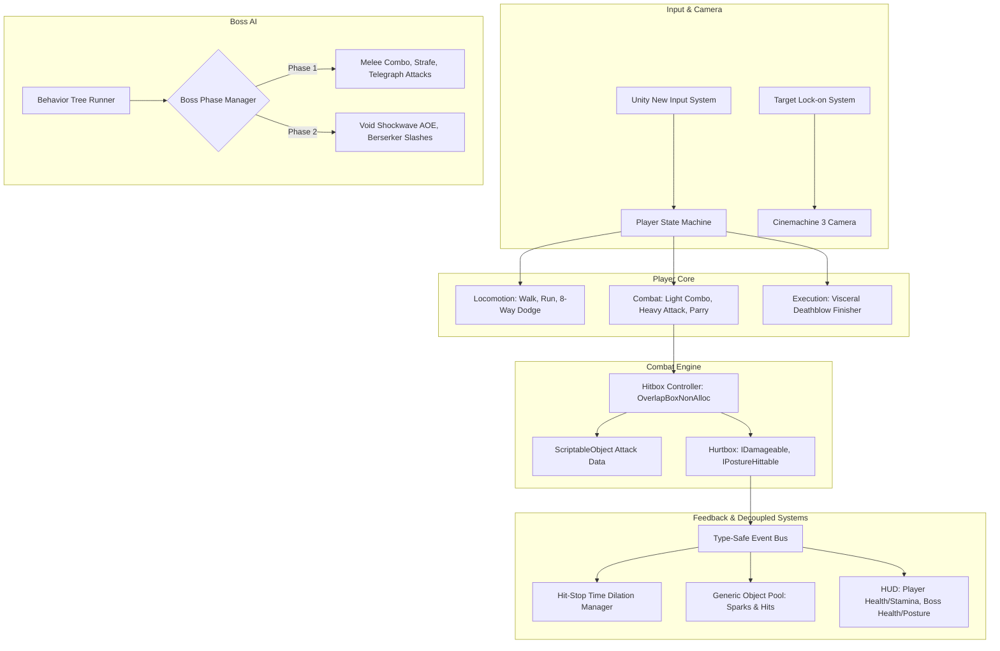

# Aetherium: Voidbound

High-precision 3D action combat and boss arena vertical slice. Built with Unity 6 (C#), Universal Render Pipeline (URP), Cinemachine 3, and the New Input System.

Features frame-accurate melee combat, 8-way directional dodge with invulnerability windows, timed parry deflections, posture break states, and a multi-phase boss AI driven by a custom garbage-free Behavior Tree engine.

---

## Quickstart

Clone repository, copy environment configuration, then run make targets:

```bash
cp .env.example .env
make setup
```

Run test suite: `make test` (executes 10 unit tests via .NET SDK in ~50ms).

Verify constraints: `make verify-constraints` (verifies max 150 lines/file, zero TODOs, zero stubs).

Build standalone Linux: `make build-linux` (outputs `Builds/Linux/AetheriumVoidbound.x86_64`).

Build standalone Windows: `make build-windows` (outputs `Builds/Windows/AetheriumVoidbound.exe`).

Clean cache: `make clean-cache` (removes temporary build and cache artifacts).

---

## Unity Editor Setup & Playtest

1. Open Unity Hub, click **Add project from disk**, and select the project directory.
2. Open with **Unity 6 (6000.6.3f1)**.
3. Build complete master scene: Click menu `Tools > Aetherium > Build Master Scene (Astral Colosseum)`.
4. Generate ScriptableObject combat assets: Click menu `Tools > Aetherium > Generate Combat Assets`.
5. Open `Assets/_Project/Scenes/AstralColosseum.unity` and click **Play**.

### Default Controls

- Move: `W`, `A`, `S`, `D` or Left Stick
- Look: Mouse or Right Stick
- Light Attack: Left Click or Gamepad West
- Heavy Attack: Hold Left Click
- Parry: Right Click or Gamepad Left Shoulder
- Dodge: `Space` or Gamepad South
- Sprint: `Left Shift` or Left Stick Press
- Lock-On: Middle Click or Right Stick Press
- Visceral Finisher: `E` / Left Click on groggy target

---

## Architecture



---

## Directory Layout

```
Assets/_Project/
├── Scripts/
│   ├── Core/               # StateMachine, EventBus, Constants, GenericObjectPool
│   ├── Player/             # PlayerController, InputReader, Locomotion/Combat States
│   ├── Combat/             # HitboxController, Hurtbox, AttackDataSO, Interfaces
│   ├── Enemy/              # Behavior Tree Engine (Composite, Task, Condition), BossController
│   ├── Camera/             # LockOnTargetController, CameraShakeManager
│   ├── UI/                 # PlayerHUDController, BossHealthBar
│   ├── AudioVFX/           # HitStopManager, VFXManager, SoundManager
│   └── Editor/             # AssetGenerator, ArenaEnvironmentBuilder, MasterSceneBuilder, GameBuildPipeline
├── ScriptableObjects/      # AttackDataSO, ComboDataSO, PlayerStatsSO assets
├── Settings/               # PlayerControls.inputactions
└── Scenes/                 # AstralColosseum.unity
```

---

## Requirements

- Unity 6 LTS (6000.6.3f1) or .NET SDK 8.0+
- Packages: Universal Render Pipeline (URP 17.0.3), Cinemachine (3.1.2), New Input System (1.11.2), uGUI (2.0.0)
- Target Platforms: Linux x86_64, Windows Standalone x86_64
